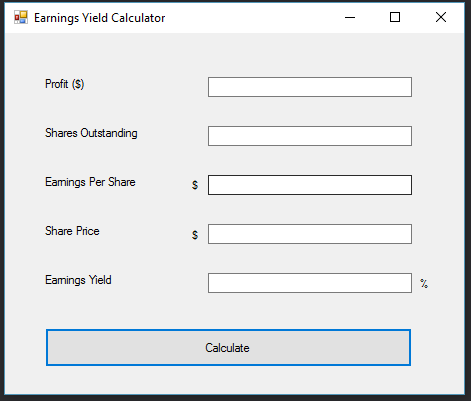

# EarningsYieldCalculator
> A form that provides the earnings per share and earnings yields calculations.

[![Build Status][travis-image]][travis-url]

## Installation
Needs Visual Studio in order to run this Windows Form.

## Instructions
The Earnings Yield Calculator works by inputting the values for Profit, Shares Outstanding and Share Price into their respective fields. Then press Calculate to get the Earnings Per Share and Earnings Yield results.

* Created using Visual Studio 2010 as a Windows Forms Project

## Meta
[Yamil Burgos](https://github.com/yamilburgos/) – yamil.burgos1293@gmail.com

## Contributing
1. Fork it (<https://github.com/yamilburgos/EarningsYieldCalculator/fork>)
2. Create your feature branch (`git checkout -b feature/fooBar`)
3. Commit your changes (`git commit -am 'Add some fooBar'`)
4. Push to the branch (`git push origin feature/fooBar`)
5. Create a new Pull Request

<!-- Markdown link & img dfn's -->
[npm-image]: https://img.shields.io/npm/v/datadog-metrics.svg?style=flat-square
[npm-url]: https://npmjs.org/package/datadog-metrics
[travis-image]: https://img.shields.io/travis/dbader/node-datadog-metrics/master.svg?style=flat-square
[travis-url]: https://travis-ci.org/dbader/node-datadog-metrics
